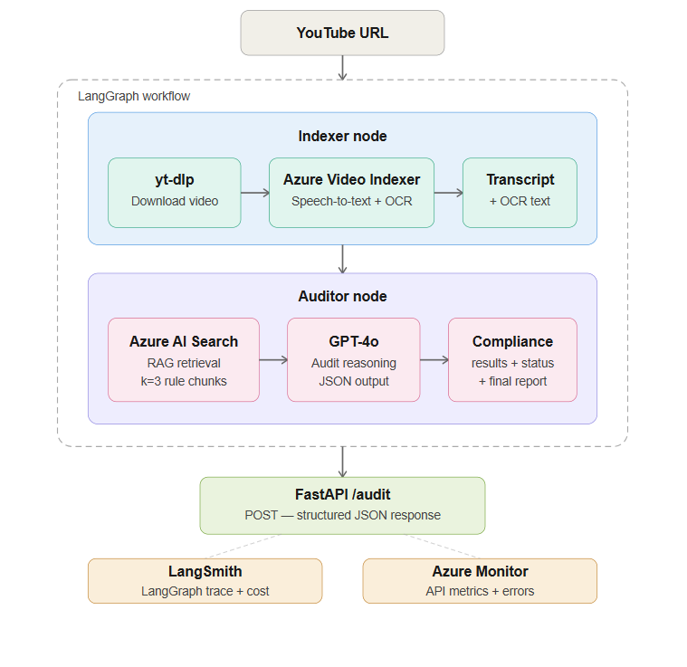

# Audit Agent

A production-grade video compliance audit pipeline built on LangGraph, Azure AI, and RAG.

Given a YouTube URL, the system downloads the video, extracts speech and on-screen text via Azure Video Indexer, retrieves relevant regulatory rules from a vector knowledge base, and returns a structured compliance report generated by GPT-4o.

---

## Architecture



**Pipeline flow:**

```
YouTube URL
    ↓
[Indexer Node]
  yt-dlp download → Azure Video Indexer → transcript + OCR
    ↓
[Auditor Node]
  RAG retrieval (Azure AI Search) → GPT-4o → compliance report
    ↓
Structured JSON: violations, severity, final status
```

---

## Tech Stack

| Layer | Technology |
|---|---|
| Agent Framework | LangGraph |
| LLM | Azure OpenAI GPT-4o |
| Embeddings | Azure OpenAI text-embedding-3-small |
| Vector Store | Azure AI Search |
| Video Processing | Azure Video Indexer |
| Observability | LangSmith + Azure Monitor |
| API | FastAPI + Uvicorn |
| Video Download | yt-dlp |
| Package Manager | uv |
| Python | 3.12 |

---

## Project Structure

```
ComplianceQAPipeline/
├── main.py                          # CLI entry point
├── backend/
│   ├── data/                        # Compliance PDF rulebooks
│   ├── scripts/
│   │   └── index_documents.py       # One-time PDF indexing script
│   └── src/
│       ├── graph/
│       │   ├── state.py             # LangGraph state schema
│       │   ├── workflow.py          # DAG definition
│       │   └── nodes.py             # Indexer and Auditor nodes
│       ├── services/
│       │   └── video_indexer.py     # Azure Video Indexer wrapper
│       └── api/
│           ├── server.py            # FastAPI application
│           └── telemetry.py         # Azure Monitor setup
├── DECISIONS.md                     # Architecture decision record
└── .env                             # Environment variables (not committed)
```

---

## Prerequisites

Four Azure services required:

- **Azure OpenAI** — deploy `gpt-4o` and `text-embedding-3-small`
- **Azure AI Search** — create an index (free F1 tier sufficient)
- **Azure Video Indexer** — create a trial account (600 free minutes)
- **Azure Monitor / Application Insights** — for observability (optional)

Plus a **LangSmith** account for LangGraph tracing.

---

## Setup

**1. Clone and install dependencies:**

```bash
git clone https://github.com/bharathsykam57-wq/Audit_Agent.git
cd Audit_Agent/ComplianceQAPipeline
uv sync
```

**2. Configure environment:**

```bash
cp .env.example .env
# Fill in all Azure credentials
```

**3. Index compliance documents (run once):**

```bash
uv run python backend/scripts/index_documents.py
```

---

## Running the Pipeline

**CLI:**

```bash
uv run python main.py
```

**API server:**

```bash
uv run uvicorn backend.src.api.server:app --reload
```

API available at `http://localhost:8000`  
Swagger UI at `http://localhost:8000/docs`

**Example request:**

```bash
curl -X POST http://localhost:8000/audit \
  -H "Content-Type: application/json" \
  -d '{"video_url": "https://youtu.be/dT7S75eYhcQ"}'
```

---

## Example Output

```json
{
  "status": "FAIL",
  "compliance_results": [
    {
      "category": "Claim Validation",
      "severity": "CRITICAL",
      "description": "SPF protection and invisible finish claims require scientific substantiation."
    },
    {
      "category": "Disclosure Placement",
      "severity": "CRITICAL",
      "description": "No clear and conspicuous sponsorship disclosure present."
    },
    {
      "category": "Disclosure Language",
      "severity": "CRITICAL",
      "description": "Terms like ad or sponsored are absent from the video."
    }
  ],
  "final_report": "The video violates multiple compliance rules..."
}
```

---

## Observability

- **LangSmith** traces every LangGraph execution — node inputs/outputs, token usage, latency
- **Azure Monitor** captures FastAPI request metrics, error rates, and dependency calls

---

## Architecture Decisions

See [DECISIONS.md](DECISIONS.md) for reasoning behind LangGraph vs chains, Azure AI Search vs FAISS, RAG vs fine-tuning, and other design choices.
